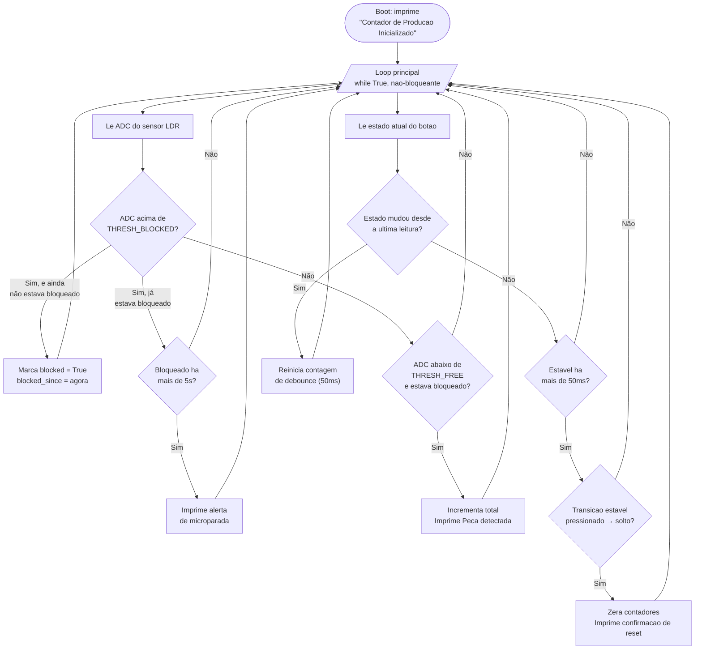

### Identificação do Candidato

- **Nome completo: Sebastião Araujo Rodrigues**
- **GitHub: <link>https://github.com/sebastiao25759</link>**

---

## Visão Geral da Solução

O objetivo do projeto é desenvolver um sistema embarcado capaz de realizar a contagem automática de peças em uma linha de produção simulada, além de detectar situações de microparada durante o processo.

O sistema utiliza um sensor LDR para identificar a passagem das peças. Sempre que uma peça bloqueia e depois libera o sensor, o contador é incrementado. Caso o sensor permaneça bloqueado por mais de cinco segundos, o sistema identifica uma microparada e exibe um alerta no terminal. Além disso, um botão permite reiniciar a contagem.

A interação do usuário ocorre por meio do botão de reset e pelo monitor serial, onde são exibidas as mensagens de contagem, alertas de microparada e confirmação do reset.

---

## Arquitetura do Sistema Embarcado

O programa foi desenvolvido em um único arquivo (main.py) e utiliza um laço infinito (while True) para realizar continuamente a leitura dos sensores e o controle da aplicação, sem nenhuma chamada bloqueante.

O funcionamento segue o seguinte fluxo:

O botão é monitorado continuamente utilizando debounce por software (janela de estabilidade de 50ms) para evitar leituras incorretas provocadas pelo efeito mecânico do acionamento. Uma decisão importante foi disparar o reset **na soltura do botão** (transição estável de pressionado para solto), e não no instante do aperto — isso evita que o reset seja acionado prematuramente enquanto o botão ainda está sendo pressionado, e reduz o risco de múltiplos disparos acidentais durante o próprio acionamento.

---

## Componentes Utilizados na Simulação

- ESP32
  - Responsável pelo processamento do programa e controle dos periféricos.
- Sensor LDR
  - Detecta a presença ou ausência da peça através da variação da luminosidade.
- Botão (Push Button)
  - Utilizado para zerar o contador de peças e reiniciar o monitoramento.
- Monitor Serial
  - Exibe as mensagens de contagem, alertas de microparada e confirmação do reset.

---

## Decisões Técnicas Relevantes

Durante o desenvolvimento foram adotadas algumas decisões para tornar o sistema simples, organizado e sincronizado corretamente com o simulador.

- Separação da leitura do sensor em uma função específica (`read_lux_raw()`), facilitando futuras alterações.
- Utilização de constantes para armazenar os valores dos limiares do sensor, tempo de debounce e tempo de microparada.
- Uso da função `time.ticks_ms()` para controlar o tempo sem interromper a execução do programa.
- Implementação do debounce por software (50ms) para garantir uma leitura confiável do botão.
- **Reset disparado na soltura do botão**, e não no aperto: a versão inicial disparava o reset assim que o botão era detectado como pressionado (~50ms após o clique), o que causava uma dessincronia com o cenário de teste automatizado — a mensagem de confirmação era impressa antes mesmo do script começar a aguardá-la. Mover o disparo para a transição pressionado→solto resolveu esse problema e tornou o comportamento mais previsível.
- Controle da lógica utilizando variáveis de estado (`blocked`, `btn_stable`), permitindo identificar quando uma peça entrou e saiu do sensor, e quando o botão mudou de estado de forma estável.
- Remoção de qualquer laço de espera bloqueante (inclusive um `while` que aguardava a soltura do botão em uma versão anterior do código), garantindo que o loop principal nunca perca eventos do simulador.

---

## Resultados Obtidos

Ao final do desenvolvimento, o sistema apresentou o comportamento esperado.

- A passagem de cada peça é detectada corretamente.
- O contador é incrementado apenas uma vez para cada peça.
- O sistema identifica microparadas quando a peça permanece bloqueando o sensor por mais de cinco segundos.
- O botão reinicia corretamente o contador sem interferir no funcionamento do programa.
- Todas as mensagens são exibidas corretamente no monitor serial durante a simulação no Wokwi.

Os três cenários automatizados do CI (contagem de peças, detecção de microparada e reset de turno) passaram com sucesso.

---

## Comentários Adicionais (Opcional)

Durante o desenvolvimento, a principal dificuldade foi calibrar corretamente os valores do sensor LDR, pois a leitura do ADC varia de forma **inversa** à intensidade da luz: em 800 lux (linha livre) o valor bruto do ADC ficou em torno de 773, enquanto em 50 lux (peça bloqueando) ele subiu para cerca de 2532. Foi necessário rodar a simulação com prints de depuração para descobrir essa relação antes de definir os limiares corretos (`THRESH_FREE` e `THRESH_BLOCKED`).

Outra dificuldade foi identificar que o reset dependia do momento exato em que a mensagem era impressa em relação aos passos do cenário de teste: mesmo com a mensagem correta sendo exibida no serial, o teste automatizado só reconhece o texto se ele for emitido depois que o próprio passo `wait-serial` começa a monitorar a saída. Isso levou à decisão de mover o disparo do reset para a soltura do botão.

Como melhoria futura, seria possível adicionar um display OLED para exibir o número de peças em tempo real, armazenar os dados em memória para geração de relatórios e enviar informações para um servidor utilizando Wi-Fi.

O desenvolvimento permitiu aplicar conceitos importantes de sistemas embarcados, como leitura de sensores analógicos, tratamento de entradas digitais, temporização não bloqueante, debounce de botões e implementação de lógica baseada em estados.